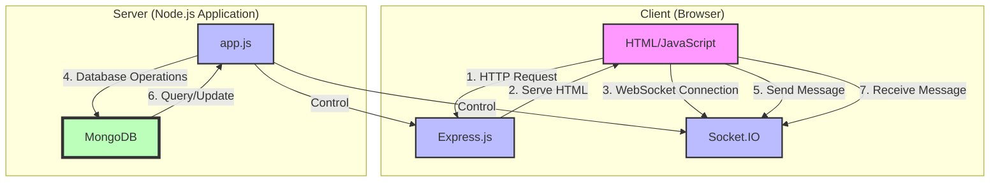

# Simple Chat Application

This is a simple real-time chat application built with Node.js and Socket.IO.
## App Profile
<!-- Badges -->
<table>
  <tr>
    <td>License</td>
    <td>Lang</td>
    <td>DB</td>
  </tr>
  <tr>
    <td>
      <a href="./LICENSE">
        
      </a>
    </td>
    <td>
      
      
      
    </td>
    <td>
      
    </td>
  </tr>
</table>


## System Architecture


## Features

- Real-time messaging: Users can send and receive messages instantly.
- Multiple clients: The chat supports multiple users connecting simultaneously.
- Simple interface: A clean, easy-to-use chat interface.

## Prerequisites

Before you begin, ensure you have met the following requirements:

- You have installed the latest version of [Node.js and npm](https://nodejs.org/en/download/).
- You have a Windows/Linux/Mac machine.

## Installing Simple Chat Application

To install the Simple Chat Application, follow these steps:

1. Clone the repository or download the source code.
2. Navigate to the project directory in your terminal.
3. Run the following command to install the required dependencies:

```
brew install mongodb-community
npm install
```

## Using Simple Chat Application

To use the Simple Chat Application, follow these steps:

1. Start the server by running the following command in the project directory:

```
brew services start mongodb-community
npm run dev
```

2. You should see the message "Server running on port 3000" in the console.
3. Open a web browser and go to `http://localhost:3000`.
4. You should now see the chat interface.
5. Open multiple browser windows pointing to the same URL to simulate multiple users.
6. Start chatting!


https://github.com/Senriyama/websocket-chat/assets/65900702/8f399b31-6513-4b6a-9936-b046454aac89


## License

This project uses the following license: [MIT License](<link_to_license>).
